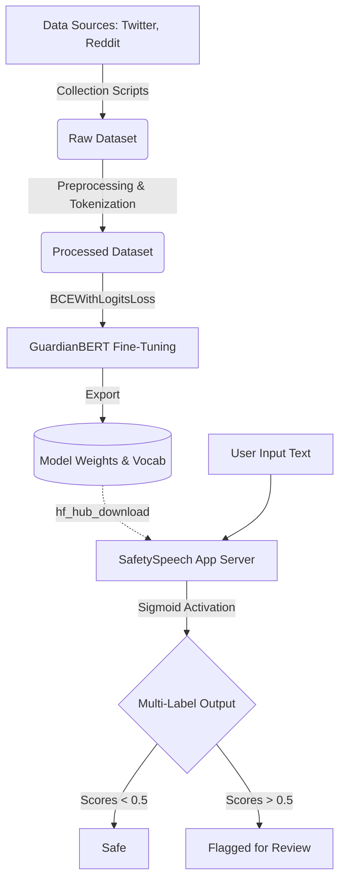
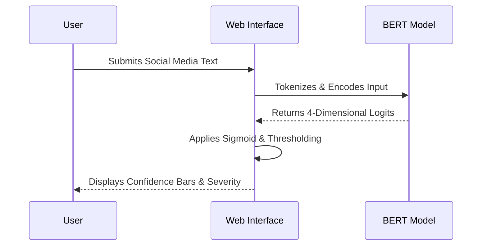

<div align="center">
  <h1>🛡️ SafetySpeech</h1>
  <p><strong>A Production-Grade Multi-Label Toxic Content Detection Architecture</strong></p>

  <a href="https://huggingface.co/spaces/aryan012234/safetyspeech-app"></a>
  
  
  
  
</div>

<br/>

## 🌐 Try the Live Application
Interact with the live, deployed SafetySpeech model powered by Hugging Face Spaces. The interface allows input testing against real-time model inference.

👉 [**Launch SafetySpeech Live App**](https://huggingface.co/spaces/aryan012234/safetyspeech-app)

---

## 🔍 Overview
SafetySpeech is a highly accurate AI system designed to intelligently analyze social media text, forum posts, and user submissions, automatically detecting harmful content and categorizing its severity for human review.

### Detection Capabilities
* **Normal:** Safe, non-toxic content
* **Depression:** Hopelessness, self-harm ideation, expressions of grief
* **Hate Speech:** Racial, gender, religious, or political targeted abuse
* **Violent:** Threats, incitement to violence, and physical harm

---

## 🧠 Model & Technical Specifications

SafetySpeech is built on top of state-of-the-art Natural Language Processing transformers, fine-tuned specifically for extreme behavioral context recognition.

* **Base Architecture:** `bert-base-uncased`
* **Total Parameters:** ~110 Million
* **Vocabulary Size:** 30,522 tokens
* **Max Sequence Length:** 128 tokens
* **Optimizer:** AdamW (Learning Rate: 2e-5)
* **Training Hardware:** NVIDIA GPU T4 x2
* **Total Training Time:** ~60 Minutes (5 Epochs)
* **Loss Function:** `BCEWithLogitsLoss` (with positive weight balancing)

### 📊 Performance Metrics
The model achieves rigorous accuracy across all highly sensitive labels on an unseen test split:
* **Overall Micro F1 Score:** `0.8489`
* **Overall Macro F1 Score:** `0.6299`
* **Label - Hate Speech F1:** `> 0.81`
* **Label - Depressive F1:** `> 0.79`

### 📚 Training Datasets
The model was fine-tuned on a robust, multi-source compilation of nearly 330,000 human-annotated inputs:
1. **Jigsaw Toxic Comments:** ~160,000 samples (general toxicity, threats, insults)
2. **Davidson Hate Speech:** ~25,000 samples (hate speech vs offensive language)
3. **Depression Reddit:** ~7,700 samples (clinical depression indicators)
4. **UCSD Measuring Hate Speech:** ~135,000 samples (diverse hate speech benchmarks)

---

## 🏗️ System Architecture

Our end-to-end pipeline spans from active data collection to high-performance inference via a fine-tuned Transformer backend.



---

## ⚙️ How It Works (User Flow)



---

## 📂 Project Structure

```text
safetyspeech/
├── data/
│   ├── raw/                 # Raw downloaded CSV data
│   └── processed/           # Cleaned train/val/test splits
├── models/                  
│   └── checkpoints/         # Pre-trained .pt weights
│       └── tokenizer/       # BERT vocab parameters
└── src/
    ├── collect/             # Scrapers for Reddit/X
    ├── preprocess/          # Text cleaning and tokenization
    ├── models/              # GuardianBERT PyTorch classes
    ├── inference/           # Real-time predictor modules
    └── ui/                  # Gradio application server
```

---

## 🚀 Local Development Setup

### 1. Environment Configuration
```bash
python -m venv guardian_env
source guardian_env/bin/activate  # On Windows: guardian_env\Scripts\activate
pip install -r requirements.txt
python setup_structure.py
```

### 2. Training the Model
```bash
python train.py --config config.yaml
```

### 3. Launching Locally
```bash
python app.py
```

*This application is strictly designed for research and AI safety moderation assistance. It does not replace human judgment.*
