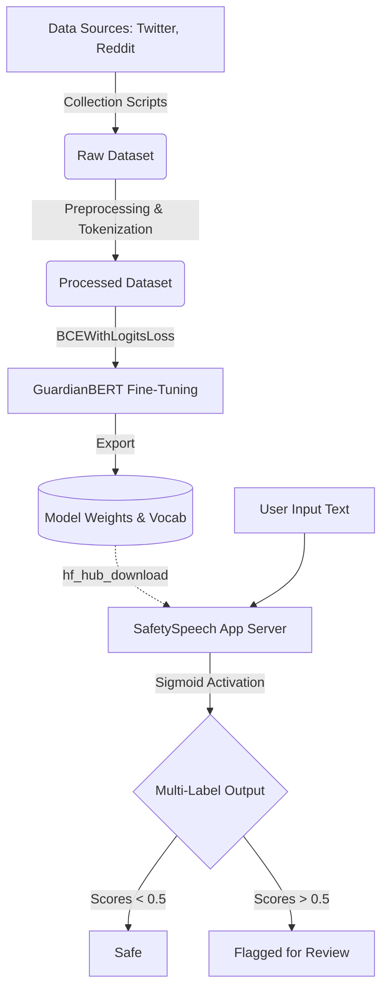
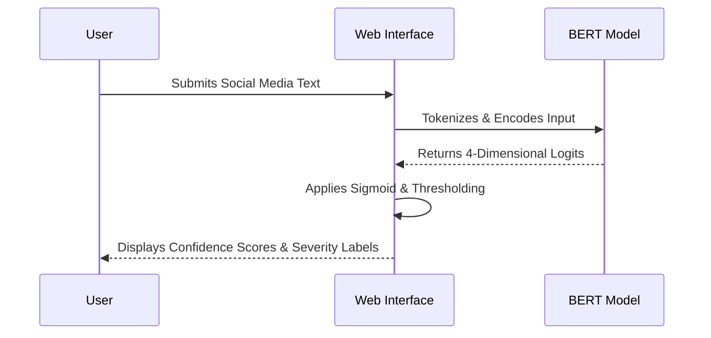

# SafetySpeech

**A Production-Grade Multi-Label Toxic Content Detection System**


[Launch Live Application](https://huggingface.co/spaces/aryan012234/safetyspeech-app)

---

## Overview

SafetySpeech is a high-accuracy AI system engineered to analyze social media text, forum posts, and user-generated content — automatically identifying harmful material and classifying it by category for downstream human review. The system is built on a fine-tuned BERT transformer and performs multi-label classification across four behavioral categories:

- **Normal** — Safe, non-toxic content
- **Depression** — Expressions of hopelessness, self-harm ideation, or acute grief
- **Hate Speech** — Targeted abuse based on race, gender, religion, or political affiliation
- **Violent** — Threats, incitement to violence, or language promoting physical harm

---

## Model & Technical Specifications

SafetySpeech is fine-tuned on top of a state-of-the-art NLP transformer backbone, optimized specifically for extreme behavioral context recognition.

| Parameter | Value |
|---|---|
| Base Architecture | `bert-base-uncased` |
| Total Parameters | ~110 Million |
| Vocabulary Size | 30,522 tokens |
| Max Sequence Length | 128 tokens |
| Optimizer | AdamW (LR: 2e-5) |
| Loss Function | `BCEWithLogitsLoss` with positive weight balancing |
| Training Hardware | NVIDIA T4 GPU ×2 |
| Training Duration | ~60 minutes over 5 epochs |

### Performance Metrics

All metrics are evaluated against a held-out test split unseen during training:

| Metric | Score |
|---|---|
| Overall Micro F1 | 0.8489 |
| Overall Macro F1 | 0.6299 |
| Hate Speech F1 | > 0.81 |
| Depressive Content F1 | > 0.79 |

### Training Data

The model was trained on a curated, multi-source corpus of approximately 330,000 human-annotated samples spanning a broad range of toxicity signals:

| Dataset | Volume | Coverage |
|---|---|---|
| Jigsaw Toxic Comments | ~160,000 | General toxicity, threats, insults |
| Davidson Hate Speech | ~25,000 | Hate speech vs. offensive language |
| Depression Reddit | ~7,700 | Clinical depression indicators |
| UCSD Measuring Hate Speech | ~135,000 | Diverse hate speech benchmarks |

---

## System Architecture

The end-to-end pipeline spans data ingestion, preprocessing, model fine-tuning, and real-time inference via a hosted Transformer backend.



---

## Inference Pipeline



---

## Project Structure

```text
safetyspeech/
├── data/
│   ├── raw/                 # Raw downloaded CSV data
│   └── processed/           # Cleaned train/val/test splits
├── models/
│   └── checkpoints/         # Pre-trained .pt weights
│       └── tokenizer/       # BERT vocabulary parameters
└── src/
    ├── collect/             # Scrapers for Reddit/X
    ├── preprocess/          # Text cleaning and tokenization
    ├── models/              # GuardianBERT PyTorch class definitions
    ├── inference/           # Real-time predictor modules
    └── ui/                  # Gradio application server
```

---

## Local Development Setup

### 1. Environment Configuration

```bash
python -m venv guardian_env
source guardian_env/bin/activate  # Windows: guardian_env\Scripts\activate
pip install -r requirements.txt
python setup_structure.py
```

### 2. Model Training

```bash
python train.py --config config.yaml
```

### 3. Running the Application

```bash
python app.py
```

---

*SafetySpeech is intended strictly for research purposes and AI safety moderation assistance. It is not a substitute for human judgment.*
